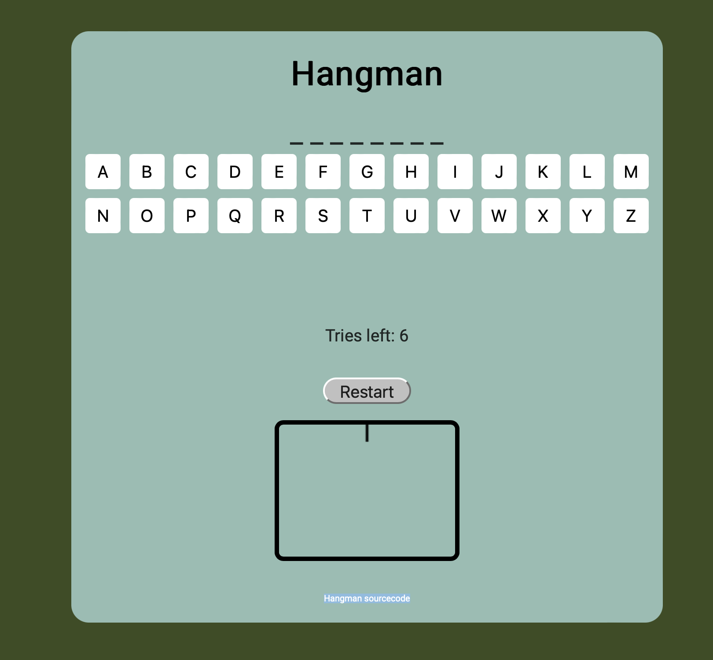

HANGMAN

Autor / Jörgen Kristofer Rebane

Rakenduse funktsionaalsus:
* Mängija peab ära arvama peidetud sõna valides olemasolevate tähtede seast õiged tähed.
* Kokku on proove 6 ja iga õigesti arvatud täht avaldatakse sõnas.
* Iga valesti arvatud tähe puhul tekib mänguväljale hangman'i üks osa.
* Kui kõik 6 arvamist saavad otsa on mäng läbi ja mängulauale on tekkinud hangman'i kuju.
* Mängu saab iga hetk uuesti alustada vajutades "restart" nupule.

Hangman source code - https://github.com/devression/hangman-game-js/tree/main
